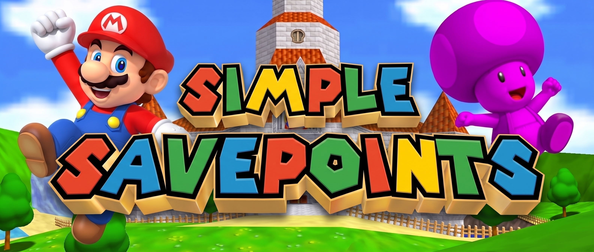

# Simple SavePoints

**Simple SavePoints** is a save-and-load checkpoint mod for **SM64 Co-op Deluxe**. It gives every player four independent save slots, keeps those slots between game sessions, and restores much more than Mario's position—including collectibles, inventory, timed races, held objects, ridden shells, Bowser fights, and the camera view.

The mod is designed for multiplayer: each player's checkpoints stay on their own computer, use only their own controls, and do not send custom SavePoint data to the host or other players.

> Current version: **v1.57**  
> Authors: **Toxikskull & GazzyGaz**

## Features

### v1.57 shell and penguin corrections

- Cross-level shell loads allow destination setup to settle before attaching the ride. During this short stage,
  only the loading player's physics and surface hazards are suppressed; other players continue normally.
- New ridden shells explicitly receive their ride action and interaction type, without replaying stale stop-riding
  flags. This also addresses the native invalid-shell check before the shell's first behaviour update.
- Shell restoration clears residual quicksand depth and soft-resets the camera after attachment, then restores
  the saved view. Free Camera and Analog Camera preferences are not changed.
- Baby penguins are an exception to private carryable restoration: the mod reuses the matching synchronized bird
  and sends its held state instead of spawning a local copy that the native penguin behaviour later synchronizes.
  Subsequent loads release the bird normally; they never delete it as a disposable checkpoint replacement.
- If a saved penguin is missing or held by another player, restoration retries briefly and then reports that the
  position loaded without it. It does not create a duplicate or take another player's held bird.
- Restart the session/re-enter the level to clear duplicates already created by an older version. This update
  intentionally does not try to delete ambiguous shared objects already in play.

These changes have been syntax-checked and reviewed against the engine source, not gameplay-tested. Manual tests
should cover cross-level and repeated shell loads over lava, quicksand and slopes; quicksand camera recovery;
and host/client penguin saves, dropping/reloading, two different babies, and another player holding the saved bird.

### Four independent persistent save slots

- D-pad Up, Left, Down, and Right each have a separate checkpoint.
- Every slot survives closing and reopening the game.
- Saving to one direction does not overwrite the other three directions.
- Empty or invalid slot files are ignored safely.
- If persistent storage is unavailable, the new checkpoint remains usable for the current session and an on-screen message explains that it could not be written permanently.

### Current saves HUD

- Type `/saves` to show or hide a non-clickable overlay on the left. It starts hidden each session.
- A 60%-opaque black rectangle encloses the overlay. The heading uses CoopDX's title font with letters cycling red, green, blue, and yellow; the save rows retain their existing shadows and alignment.
- The right-facing arrow compensates for the native texture's transparent padding so its visible triangle aligns with the left-facing arrow.
- The compact layout uses equally sized bold destination labels, smaller regular-weight right-aligned timestamps, equal-size arrows, and evenly spaced rows. All text has a dark drop shadow. The whole overlay scales together to fit its left-hand column rather than changing font sizes from slot to slot.
- Four native gold direction arrows identify Up, Down, Left, and Right. Each saved slot shows its full level name and act; Bowser battle maps omit the act. Empty slots say **Slot empty** in red.
- The line underneath shows the local creation date/time, for example `25/09/2026, 18:43`. New saves update the enabled overlay immediately, and timestamps survive restarting the game. Loading a slot does not change its date.
- Existing saves without a recorded date show **Date unavailable** until saved again.
- The overlay remains visible while enabled, including when browsing the native pause/mod menu. Automatic display for only the SavePoints submenu is not available in this CoopDX build.
- The Saves menu reuses this overlay's rendering, with clickable entries and a Back button. The `/saves` overlay remains non-clickable. Unchanged rows reuse cached text; only creating a save writes timestamp data to disk.

### Multiplayer-safe, per-player checkpoints

- Save data belongs only to the player who created it.
- One player's save/load input cannot activate another player's slots.
- The mod sends no custom checkpoint packets or synchronized save tables.
- Personal coin and 1-Up history is hidden or restored locally instead of deleting synchronized objects for the lobby.
- Cap-block items and native shells are never treated as personal collected coins, so they remain visible and usable by peers.
- Recreated carried items stay private to the loading player; a recreated ridden shell keeps one real gameplay object for its owner and a local, non-interactive visual fallback for peers if CoopDX drops the synchronized shell.
- Restored-shell visibility uses only tiny event messages when a ride settles, ends, or needs a late-player refresh; it does not stream checkpoint state or send per-frame network traffic.
- Saving and loading performs no lobby-wide file or checkpoint synchronization, avoiding host freezes caused by other players' save files.

### Player position and condition

Each checkpoint remembers:

- Level, area, and mission/act used when entering the destination.
- Mario's exact position and facing direction.
- Whether Mario was on land, genuinely underwater, in ordinary air, actively flying, or floating in a death bubble.
- Health.
- Lives and castle keys.
- Coin count, red-coin count, and secret count.
- Cap state, whether the cap is worn or held, and the remaining cap timer.

Ordinary loads use a safe neutral land, air, or water action and clear stray movement that could push Mario away from the checkpoint. Active flight instead restores the flying action, wing cap, direction, and momentum. A floating multiplayer death bubble restores through CoopDX's native bubble lifecycle without deducting another life.

When a load begins underwater but ends on land, the mod gives CoopDX one normal water-exit update before settling on land. This clears the old low water camera without applying an underwater state to the land checkpoint.

After Mario reaches the saved location, a two-frame safety window prevents an immediate collision without making the character flash between visible and invisible. A full cross-level load keeps the game's safe level setup but replaces its lingering entry wipe as soon as the checkpoint is ready.

Cross-level flying loads also select the correct flying animation before restoring motion, preventing the destination's entry flip from remaining attached to the flying pose.

### Camera restoration

- Saves the rendered camera position, focus, angle, distance, and smoothing state.
- Loads the saved view immediately instead of slowly panning from the player's previous height or angle.
- Briefly reasserts that view while late water/warp camera setup settles, then releases normal camera control.
- Uses the rendered Lakitu view when CoopDX's direct-area helper still exposes the previous Area camera, so a later
  save made after crossing an instant warp does not inherit stale camera angles.
- Uses the game's normal submerged-to-walking transition on water-to-land loads so a low water camera cannot remain attached to Mario.
- Prevents high-to-low or low-to-high loads from making the camera travel through terrain.
- Works with the player's current Free Camera or Analog Camera preference; the mod restores the view without changing the chosen camera mode.

### Cross-level, cross-area, and instant-warp loading

- A checkpoint can be loaded from another level or area.
- A cross-level checkpoint replaces the normal painting/door entry action on the first initialized destination frame,
  so Mario does not drop in and land before being moved to the savepoint.
- Each cross-level load uses one successful safe entry request and never enters through a death exit or initializes the destination twice.
- If an internal area has no normal entry node, the mod safely builds the course through area 1, switches to the saved
  internal area, and stages Mario and the camera there before play resumes. This includes WDW downtown saves loaded
  from outside Wet-Dry World.
- Moving between two areas of the same level uses an immediate area change instead of replaying the level-entry drop. This includes the Wet-Dry World downtown tunnel.
- A cross-level checkpoint load suppresses the unrelated star-shaped arrival wipe before it can be shown, including after using **Choose level**.
- Checkpoints made beside instant-warp surfaces are placed safely on the intended side, preventing an immediate accidental re-warp.
- Cross-area loads wait briefly for synchronized Bowser data when a boss checkpoint requires it.

### Persistent collectibles and inventory

The checkpoint records supported personal pickups already collected in the area, including:

- Coins, including red coins.
- 1-Ups.

Caps and Koopa shells use their dedicated inventory/interaction restoration paths rather than the personal pickup-hiding list. This keeps cap-block spawns and ridden shells visible and interactive for other players.

Loading restores the selected slot's local pickup history. An object already collected in that checkpoint remains unavailable to that player, while other players can still see and collect their own copy. Later pickups do not modify the saved slot, so repeatedly loading the same checkpoint produces the same result.

### Held objects and ridden shells

Saving while carrying or riding a supported object preserves the connected Mario/object state rather than restoring only Mario's pose.

- Boxes, Bob-ombs, and other ordinary carryable objects return in Mario's hands.
- A lit Bob-omb keeps its remaining fuse time instead of restarting its timer.
- Land and underwater Koopa shells return beneath Mario in the correct riding state.
- Other players retain a visible shell under the rider even when CoopDX removes its native synchronized copy during reconstruction.
- Object position, movement, angles, action, animation, scale, physics values, health, and relevant timers are restored where available.
- Dropping, throwing, or dismounting after a load continues through the game's normal interaction behavior.
- Repeated loads replace the previous restored object instead of accumulating duplicates.
- Restarted saves use the same area and object identities as live saves. Saving a restored held item into another slot keeps its original identity, so subsequent loads replace the copy and hide the matching original locally.

### Bowser fight restoration

Bowser uses a dedicated restoration path and treats each arena as shared world state. A load never creates a replacement Bowser or independently rewinds only one part of the fight.

- In an unoccupied compatible Bowser 1 or Bowser 2 fight, saving while holding Bowser's tail restores Mario holding and spinning the native synchronized Bowser.
- Spin angle, spin momentum, animation timing, and the connected Mario action are preserved.
- Releasing or throwing Bowser continues through the normal boss logic.
- In an unoccupied compatible Bowser 1 or Bowser 2 fight, saving while Bowser is free restores his position, movement, health, action, timers, and animation—for example, an in-progress fire-breathing attack.
- Bowser 2's tilting platform angle and motion are saved with the fight. Mario's saved point is also tied to the platform, preventing the floor from tilting away while Mario returns over lava.
- If another player is in the arena, the live shared boss, platform, mines, hazards, health, and rewards are never rewound. Mario is placed relative to the current platform instead.
- A saved tail hold is not restored while the arena is shared, because taking ownership would steal or interrupt Bowser for the other players. An on-screen message explains this exception.
- Consumed mines, changed boss health, or an existing reward mark irreversible progress. Loading preserves that live progress rather than creating a mismatched boss and arena.
- Bowser 3's destructible floor always remains live. A surviving saved floor section provides safe platform-relative placement; if the section is gone, the position load is refused with a clear message.
- The native Bowser root is reused; child parts such as the jaw and tail are never cloned independently.
- Staged loading waits for Bowser's complete synchronized object hierarchy before reconnecting Mario.
- Render safeguards prevent a second overlapping Bowser while he is held and reveal the world model again immediately after release.
- An intentional release cancels only the temporary restoration work and leaves native throw momentum and off-stage return behavior intact.

### Timed races

#### Princess's Secret Slide and private timers

- The local player receives an independent slide timer.
- Saving during an active run records the exact displayed time.
- Loading resumes from that saved time without taking another player's timer state.
- A checkpoint made on the finish surface restores the exact finished time as a stopped display instead of restarting it.
- Another player's save, load, arrival, departure, start, or finish cannot reset or advance the local timer.
- The local HUD hides a remote player's native slide timer when this player does not own a run, and reasserts the local running or finished time after shared timer writes.
- Finishing below the configured 21-second limit still creates a local time-trial star if another player changed the game's shared slide-start flag; the fallback first checks for the native star so it cannot create a duplicate.

#### Koopa the Quick

Koopa the Quick is intentionally treated as one shared lobby race, matching normal multiplayer behavior.

- Only the game's single synchronized Koopa race may be active.
- Saving and loading can move Mario back to the saved position while the live race continues.
- Loading never rewinds Koopa, the shared race timer, the finish state, or another player's progress.
- Joining or returning to the mission continues to follow the game's current shared race state.
- When the game ends or resets the race normally, Koopa remains available for the next normal race.

### Stable repeated loading

- Mario's visual object is moved together with the gameplay state, preventing repeated-load height drift.
- A one-step physics guard protects corrected instant-warp positions.
- If another load is pressed while a level is still being built, only the newest requested slot is queued and run
  after the active load finishes; native level initialization is never overlapped or cancelled halfway through.
- Previous held objects, shell links, Bowser staging, timer overrides, camera work, and pending warps are cleared before a new load takes ownership.
- Delayed engine objects use short, bounded retries and cleanly give up rather than running permanent recovery loops.
- Save/load input is ignored while Mario is controlled by an unsafe death transition, cutscene, teleport, or intangible transition, avoiding hidden or stuck states.
- The stable floating multiplayer death-bubble state is deliberately allowed: it can be saved, loaded from another state, and loaded again while still bubbled.

### Clear in-game feedback

- Saving and loading produce distinct menu sounds, sparkles, and directional slot popups.
- Loading an unused direction reports that no checkpoint exists in that slot.
- A persistent-write failure reports that the checkpoint is available only for the current session.
- A cross-area load reports an unavailable destination only after both its saved-area entry and safe area-1 route are
  unavailable; bounded recovery cannot leave a permanent pending load.

### SavePoints menu

The native menu has four buttons, in order: **Warp to player...**, **Choose level**, **Current saves**, and **Preferences**. Each opens a mouse-operated side panel beside the native menu, following the original player picker's layout. Each panel uses the Current saves title font, alternating red/green/blue/yellow letters, and 60%-opaque black background. Each has its own **Back** button with the normal closing sound. No replacement pause system or global theme change is used.

**Current saves** shows the same heading, colours, arrows, destinations, timestamps and spacing as `/saves`. Click an entry, then close the pause menu to load through the normal checkpoint loader. D-pad saving and loading are unchanged. Keyboard/controller navigation still belongs to the native pause menu; this build does not expose its captured input to the side panels.

Level and player page arrows have separate hitboxes directly beneath the visible arrows. The central page counter is not clickable. Next advances one page and wraps from the last page to the first; Previous does the reverse.

Toggling **Save/load only mode** prints a chat message in the same style as the personal preferences: **Save/load only mode: enabled** (enabled in green) or **Save/load only mode: disabled** (disabled in red).

**Preferences** contains tickable Full HP on load and Restore saved coins settings. Only the host also sees **Save/load only mode**. It starts off each session and applies to every player running this version. While enabled, Warp to player and Choose level display **"Feature currently unavailable, save/load only mode is enabled"**. Pending travel that has not started is cancelled; a level transition already underway is allowed to finish safely. Saves and checkpoint loads remain available. This is a cooperative session setting, not protection against modified clients or other mods' warp commands.

#### Warp to player (new; multiplayer validation pending)

Selecting a player shows **“<name> selected. Close the pause menu to travel.”** Mouse hitboxes account for UI scaling. The visit queue runs during general updates and releases the native gameplay pause after its panel closes. Use the clickable **Back** button to dismiss just the picker and return to the main SavePoints page. Escape remains a native-menu Back key: this engine handles it before Lua and cannot safely reserve its first press for the custom picker.

The green **Warp to player...** button on the main page opens the original player picker beside the native menu. Click a connected player, then close the native pause panel to start travel. The picker includes your own name for context but disables self-selection. Arrow controls change pages; clicking outside dismisses it.

When you close the native menu, one request asks the target to capture their exact location, facing direction, and movement. Capture occurs when the request reaches their computer, so network latency applies. That snapshot stays fixed while you travel: you do not chase their later position. Arrival replaces the level entrance action on the first initialized Mario frame, including across levels, areas, acts, and Bowser fights. No persistent slot, shared boss, or platform is restored.

Flight, swimming, sliding, pole/tree climbing, and ceiling/ledge hanging retain their movement state. Flight initializes the flying animation and wing-cap support. You arrive holding and riding nothing; the target's objects are never cloned or altered. A Princess's Secret Slide visit adopts the target's captured private timer (running or finished), without changing theirs. Koopa the Quick's shared race continues normally. Exact placement briefly disables player-only collisions for half a second, then ordinary collision resumes.

The target must be synchronized and outside cutscenes, warps, act selection, and death bubbles. Cannons/unsupported automatic rides, missing climbing supports, invalid hanging ceilings, unsafe lava landings, disconnects, and missing replies report **“<player name> is currently unavailable”**. If a destination fails after travel begins, you remain at the native entry/current location rather than starting another warp.

All players should use **v1.57** for a consistent session. The existing movement-snapshot protocol is unchanged. Visits send one direct request/reply exchange per journey, plus two small collision-grace state changes; there are no disk writes or continuous position broadcasts. Earlier validation included deterministic movement tests, native cross-level ground/flight arrivals, existing Bowser checks, and a localhost host/client ground visit. Broader multiplayer gameplay testing is still needed; these earlier checks do not establish that every v1.57 scenario has been tested.

Player visits reset temporary camera modes to the destination area's default and let native camera logic establish the local view. Free Camera and Analog Camera preferences are not changed, and the target's camera is not copied. Two brief post-camera passes retain the collision-adjusted result without interpolating from the old location. Boss visits avoid replaying arena-entry camera cutscenes. Ordinary checkpoint camera restoration remains unchanged.

The native mod-menu title retains its green name. The player picker is titled **Choose player**, using the title font and the current native rainbow palette. Its **Back** button plays the same closing sound as native menu Back.

#### Standard level selection

- A **Choose level** list is available on the mod's CoopDX menu page.
- The side panel shows seven levels per page and includes every playable standard SM64 level under its full name: castle areas, secret stages, Bowser courses, and their separate battle maps.
- Click the page arrows and a destination. After selecting, close the pause menu with Start or return to the main page and choose **Resume**; the level change begins as soon as CoopDX closes its panel.
- Courses open through the game's normal act/star selection screen. Castle areas that do not have acts load directly.
- The selection bypasses the star count normally required to reach a door or painting. It does not award stars, unlock doors, or change save-file completion.
- The list is local menu UI and sends no checkpoint data or per-frame network traffic.

CoopDX's public Lua API permits mods to add controls only to their own mod-menu page. If several enabled mods add menu controls, open **Pause > Mod Menu > Simple SavePoints v1.57**. If SavePoints is the only mod contributing menu controls, CoopDX can expose its page directly on the main pause screen. The mod does not replace or patch the shared pause menu, which keeps it compatible with other public mods.

## Controls

| Input | Result |
| --- | --- |
| D-pad Up | Save to the Up slot |
| D-pad Left | Save to the Left slot |
| D-pad Down | Save to the Down slot |
| D-pad Right | Save to the Right slot |
| L Trigger + D-pad Up | Load the Up slot |
| L Trigger + D-pad Left | Load the Left slot |
| L Trigger + D-pad Down | Load the Down slot |
| L Trigger + D-pad Right | Load the Right slot |

The D-pad direction must be newly pressed. Hold **L Trigger** while pressing the direction to load; pressing the direction without L saves instead.

## Local preferences

The health and coin settings affect only the local player and last for the current game session. They can be changed with the tickable options in Preferences or with the equivalent chat commands, and they do not rewrite existing checkpoint files. The host's separate Save/load only mode is session-wide.

| Command | Effect | Default |
| --- | --- | --- |
| `/fullhp` or `/fh` | Toggle between loading the exact saved health and refilling to the highest health seen this session | Exact saved health |
| `/keepcoin` or `/kc` | Toggle whether loading restores the checkpoint's saved coin total or leaves the current total alone | Restore saved coins |

## Persistence

The four slots are stored through SM64 Co-op Deluxe's ModFS system:

| Slot | File |
| --- | --- |
| Up | `checkpoint-up.sav` |
| Left | `checkpoint-left.sav` |
| Down | `checkpoint.sav` |
| Right | `checkpoint-right.sav` |

All files are read once when the mod starts. A save writes only the selected slot, and a load uses the already-decoded in-memory checkpoint without reading the disk. Each file is validated before use; a missing, truncated, damaged, or incompatible file is treated as an empty slot.

## Performance design

Simple SavePoints is structured to avoid affecting the host or other players:

- No custom save-state network traffic.
- No disk access during loading or normal per-frame gameplay.
- Closed subpages do no rendering work. The optional `/saves` HUD returns immediately when hidden and otherwise draws only four cached slot summaries. The host restriction synchronizes only when initialized or toggled, not every frame.
- One small local file write only when the player explicitly saves.
- Bowser arena scans run only when saving/loading a boss checkpoint or briefly staging a tail restore; no new continuous world scan or custom network packet was added.
- Object identity work is skipped unless a restored object or collectible set actually needs it.
- Personal collectible visibility is checked on a throttled schedule.
- Cross-level loads perform only one successful safe entry initialization. A failed probe for an entryless internal area
  does not start the engine; its area-1 route then builds the level once. Same-level area loads use the engine's direct
  area switch. This prevents Game Over/Bowser-laugh transitions, duplicated level setup, and lost restored interactions
  such as shell riding.
- A missed Princess's Secret Slide reward is created only for the qualifying local player and adds no synchronized object traffic.
- The only new shared object traffic is the native synchronized shell created when a player loads a shell-riding checkpoint.

## Installation

1. Install **SM64 Co-op Deluxe**.
2. Download the mod ZIP from [Releases](https://github.com/GazzyGaz/Simple-SavePoints/releases). If you instead download or clone the source repository, name the installed folder `Simple SavePoints v1.57` so that persistent saves use the expected folder name.
3. Place the `Simple SavePoints v1.57` folder inside the game's `mods` directory so the file layout is:

   ```text
   mods/
   └── Simple SavePoints v1.57/
       ├── main.lua
       └── README.md
   ```

4. Open SM64 Co-op Deluxe and enable **Simple SavePoints** in the Lua mod list.
5. Ensure that only one version of Simple SavePoints is enabled at a time.

Persistent slot files are created automatically after saving; users do not need to create or edit them manually.

## Scope and compatibility

- Designed for the standard SM64 Co-op Deluxe Lua API and native SM64 object behaviors.
- This is a gameplay checkpoint system, not a frame-perfect emulator savestate. Normal Mario movement is stabilized on load; detailed motion is restored where it is required for flight, bubbles, held objects, shell riding, and Bowser spinning.
- Shared lobby systems are not privately rewound. Koopa the Quick deliberately remains controlled by the active synchronized race.
- Global game progress such as collected stars, unlocked doors, and save-file completion is not changed by loading a checkpoint.
- Native coins, caps, 1-Ups, shells, common carryable objects, Bob-ombs, and Bowser receive dedicated support. Objects added by other mods may work when they use compatible native behaviors, but arbitrary custom object logic is not guaranteed.
- Camera-control preferences are not stored; the view produced by the active camera mode is stored.
- `/fullhp` and `/keepcoin` choices are session preferences and reset to their defaults when the mod restarts.

## Developer guide

The implementation stays in `main.lua`; it exports no Lua functions or tables. Start with the **Saving and loading**
section for the main flow, then follow the helpers for the feature you want to change. Local player index **0**
means this client, not necessarily the server. Comments explain the game-specific restrictions where they apply.

- **Storage:** `CHECKPOINT_FIELDS` defines the ordered binary contract; `SAVE_SLOTS` binds directions to files.
  Formats 2 and 3 remain readable, and new saves still use format 4. Append fields only with a deliberate format
  change. Loading uses in-memory tables; persistence runs only at startup and when saving.
- **Capture/restore:** `save()` takes a fresh local snapshot; `load()` either calls `apply()` or requests a
  destination that `beforeMario()` completes before physics. Keep restoration order and bounded retries intact.
- **Objects/arenas:** field maps describe supported native state. Private carryables, synchronized ridden shells
  and the native Bowser root intentionally have different lifecycles. `bossArena` owns arena safety/placement.
- **UI/travel:** `savesHud` and `playerTravel` own separate local state and private scopes. Extend `LEVEL_MENU`
  for destinations. `menuPages` owns the additional side panels and queued menu slot selection. It reuses
  `savesHud.draw()` rather than maintaining a second version of the save list. The four native registrations
  determine the main-page order; level subpages contain seven entries each.
- **Network contracts:** byte packet **91** announces cosmetic shell state; `spVisit` **3/4** is the movement
  request/reply protocol. `gPlayerSyncTable[].spVisitGrace` supplies brief player-collision grace. Custom object
  fields `oSimpleSavePointsSerial` and `oSimpleSavePointsSource` identify restored copies. Do not rename these
  contracts or alter send ownership without coordinating peers.

ModFS is keyed by the mod folder. Keep the installed folder named `Simple SavePoints v1.57`.
See **Upgrading from v1.56** below before moving existing saves to this version. The save format is unchanged.

`gGlobalSyncTable.spSaveLoadOnly` is initialized and changed only by the host. Menu travel checks it before
selection and before a queued journey starts. An already-started warp is never interrupted by a settings change.

Separate game instances using the same savepath/mod folder still share the same on-disk slots, even with different
config files or player names. Use separate savepaths for independent local-instance saves; this refactor does not
change persistence ownership.

## Reporting issues

When reporting a problem, include:

- The Simple SavePoints version.
- Whether the game was solo, hosted multiplayer, or joined multiplayer.
- The level, area, and mission.
- Which D-pad slot was used.
- What Mario, the camera, timer, Bowser, or held object was doing when saved.
- Whether the checkpoint was loaded in the same area, from another area, or after restarting the game.
- Clear reproduction steps and screenshots or video when possible.

## Credits

Created by **Toxikskull** and **GazzyGaz** for the SM64 Co-op Deluxe community.

## Upgrading from v1.56

To retain v1.56 saves, close the game and copy `sav/Simple SavePoints v1.56.modfs` to
`sav/Simple SavePoints v1.57.modfs` in your savepath, **only if the latter does not exist**.
Keep the original archive as a backup. Enable only v1.57.
