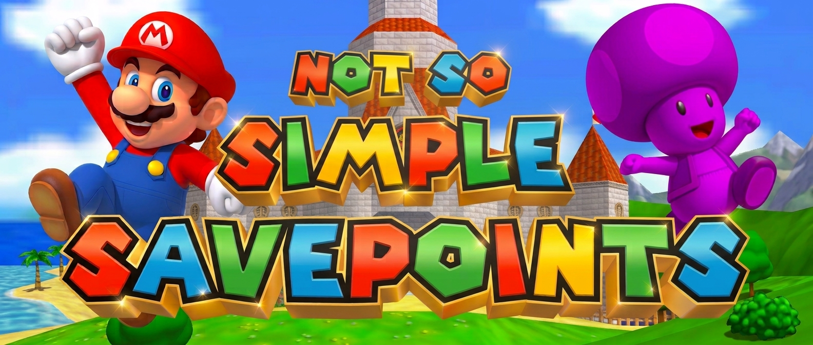

# Not So Simple (NSS) SavePoints

**Not So Simple SavePoints (NSS SavePoints)** is the spiritual successor to Simple SavePoints - it is a save-and-load checkpoint mod for **SM64 Co-op Deluxe**. It gives every player four independent save slots, keeps those slots between game sessions, and restores much more than Mario's position - including collectibles, inventory, timed races, held objects, ridden shells, Bowser fights, and the camera view.

The mod is designed for multiplayer: each player's checkpoints stay on their own computer, use only their own controls, and do not send custom SavePoint data to the host or other players.

> Current version: **v1.57**  
> Authors: **Toxikskull & GazzyGaz**

**[Download the mod](https://github.com/GazzyGaz/Not-So-Simple-SavePoints/releases/latest)** · [Wiki](https://github.com/GazzyGaz/Not-So-Simple-SavePoints/wiki) · [Report a bug](https://github.com/GazzyGaz/Not-So-Simple-SavePoints/issues)

## Features

- **Four save slots** — keep a separate checkpoint on each D-pad direction. Your saves remain available after closing the game.
- **Pick up where you left off** — return to your saved position and camera view, even from another level.
- **Save during the action** — supports flying, swimming, shell riding, supported held objects and more.
- **Practise races and boss fights** — checkpoint support for the Princess’s Secret Slide and Bowser battles, with safeguards for shared multiplayer progress.
- **Travel with friends** — warp to an available player or choose a level from the mod menu.
- **Check your saves at a glance** — see each slot’s level, act and timestamp in the Current saves menu or optional HUD overlay.
- **Choose your preferences including save/load only mode** — refill health on load, choose whether to restore saved coins, or let the host restrict the mod to saving and loading only.

## Installation

1. Download the mod ZIP from the **[latest release](https://github.com/GazzyGaz/Not-So-Simple-SavePoints/releases/latest)**.
2. Extract the included mod folder into your SM64 Co-op Deluxe `mods` folder.

   ```text
   mods/
   └── Simple SavePoints v1.57/
       ├── main.lua
       └── README.md
   ```
   
3. Enable it in the game’s mod list.

## Controls

| Action | Control |
| --- | --- |
| Save | Press any **D-pad direction** |
| Load | Hold **L Trigger** and press the same **D-pad direction** |
| Toggle the save-list overlay | Type **`/saves`** in chat |

On a keyboard, use the keys assigned to these controls in your game settings.

Open the mod menu from the pause menu to access **Warp to player...**, **Choose level**, **Current saves** and **Preferences**.

## Playing with others

Each player has their own checkpoints. The mod is designed to let you retry a section without rewinding everyone else’s game.

It is not a complete game rewind: collected stars and unlocked doors stay unlocked, and shared events such as Koopa the Quick’s race keep running. Some object and boss states also depend on what other players are doing.

For more help, feature limits and troubleshooting, visit the **[wiki](https://github.com/GazzyGaz/Not-So-Simple-SavePoints/wiki)**. Developers can find the technical details in the **[full README](https://github.com/GazzyGaz/Not-So-Simple-SavePoints/blob/main/README.md)**.

## Credits

Created by **Toxikskull** and **GazzyGaz** for the SM64 Co-op Deluxe community.
